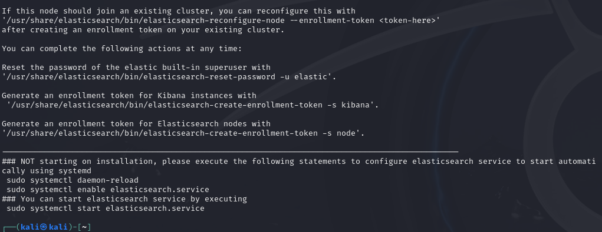

If you're here you probably want to set up a SIEM to gather logs from a machine. 
There are a couple of open source solutions out there but the ELK Stack is one of the most robust ones. But first what exactly is the ELK Stack
# What is ELK Stack?
The ELK Stack is a combination of three powerful open-source tools: Elasticsearch, Logstash, and Kibana. Elasticsearch is used for fast and scalable search, Logstash collects and processes logs or data, and Kibana helps visualize the data in dashboards. Basically, ELK is used for managing large volumes of log data, helping to search, analyze, and visualize it in real-time. It's popular in monitoring, troubleshooting, and security use cases, making it easier to track performance, identify issues, and gain insights from system logs or events. 

We will be using Elasticsearch and Kibana since Logstash is not needed for our purposes . We will use Auditbeat to send logs from Linux Devices. 

# Installing ElasticSearch: 
First you need any Linux Distribution to install Elasticsearch. We are using Kali Linux in the below examples but you may use Ubuntu or any other distribution. 
Please note that in this example we will do a bare-metal install of the ELK stack with security disabled. I will make another tutorial which has the security features enabled later on. 

We will firstly run the following command which will download the Elasticsearch GPG Key which is used to verify authenticity of the Elasticsearch Packages. 
   `wget -qO - https://artifacts.elastic.co/GPG-KEY-elasticsearch | sudo gpg --dearmor -o /usr/share/keyrings/elasticsearch-keyring.gpg` 
   

We will now run the following command `sudo apt-get install apt-transport-https` that will install a pre-requisite package that would enable the package manager to handle package downloads over HTTPS.  

Now we will run the following command: `echo "deb [signed-by=/usr/share/keyrings/elasticsearch-keyring.gpg] https://artifacts.elastic.co/packages/8.x/apt stable main" | sudo tee /etc/apt/sources.list.d/elastic-8.x.list` . 
This command basically adds the official Elasticsearch repository to our system's APT Sources.  

Now we will run this command `sudo apt-get update && sudo apt-get install elasticsearch` which will update the package list and then further install elasticsearch .  

We need to now make some changes to the config file. Before you do that however we need to first ensure some things. If you're running the Linux system on a virtual machine like Oracle VirtualBox or VMWare Workstation you need to ensure that your host system and the VM can communicate with each other i.e their IPs are visible to each other. To do this you need to run `ip addr` command in the terminal . 

Now as you can see the IP address of my machine is 192.168.240.128. I need to make sure my windows machine can communicate with it. For that we will open up the terminal on Windows and run the following command. `ping 192.168.240.128` . If the ping succeeds then we can go on. If it does not then you need to go into your virtual machine settings and change the network settings from NAT to Bridged Adapter. For virtual box the settings are here:  
 

Now we will open the config file and make some changes. To do that run the following command `sudo vi /etc/elasticsearch/elasticsearch.yml` . I am using Vim but you can use nano or any other editor you feel comfortable with.  

Scroll down to the config file until you see the Network Section. There change the network.host Ip address to your ip address. My ip right now is 192.168.240.128 but you should change it to your machine ip. Also comment in the line.  

It should look like this. 
Now scroll further down until you see the discovery section and remove host 1 and 2 and instead enter this : 

So basically enter your machine ip there. Now we will scroll down further until we come across security auto configuration. Here set every true value to false. 

Once it looks like this save the file. Now we will start elasticsearch 

Now once you're done we will use the following commands to start elasticsearch. 
`sudo systemctl daemon-reload` Which tells the system to reload it's configuration files so it can recognize new services. 
`sudo systemctl enable elasticsearch.service`
`sudo systemctl start elasticsearch.service` 

Now by default Elasticsearch runs on the loopback address and port 9200. Hence after Elasticsearch starts we can ensure whether it's listening on the port by using the following command. `curl 127.0.0.1:9200`  . 

Now once we get an output that looks like the above we can rest easy knowing that elasticsearch is working. To test whether we can access it from our windows machine run curl 192.168.240.128:9200 on the windows terminal. We will see a similar output to the one above if it installed alright. 

# Install Kibana:
Kibana is used for the dashboard and to install it we will run `sudo apt install -y kibana`. This -y parameter is used to automatically confirm yes to the confirmation question. 

We will now make some changes in the kibana.yml file using `sudo vi /etc/kibana/kibana.yml` We will scroll down until we see the heading System:Kibana server. There change the server.host ip to the machine ip. Also comment in the line

Scroll further down until you see the heading System:Elasticsearch. There change the local host parameter in `elasticsearch.hosts:["http://localhost:9200"]` to your ip. Do not change anything else. It should look like this `elasticsearch.hosts:["http://YOURMACHINEIP:9200"]` Also comment in the line. 

Once we have made those changes we will save the changes and start kibana using 
`sudo service kibana start`. If it worked properly we can ensure it's running using `sudo service kibana status`. 

Please keep in mind that kibana might start  but the dashboard takes some time to visualize. To ensure that the dashboard has loaded properly go to a web browser and enter MACHINE_IP:5601 since 5601 is the default kibana port. If kibana loads successfully then everything is working properly. 

# Install Auditbeat: 

Now we will install auditbeat on the kali machine (or any linux machine you want to). Keep in mind in our case this machine is one which has both elastic and kibana running but this could be any linux machine who's logs we want to send to our SIEM. 

To install auditbeat we will run `sudo apt install -y auditbeat` . 

After it is installed we will modify the config file using `sudo vi /etc/auditbeat/auditbeat.yml` 

Scroll to the heading which says kibana. There change the host paramter from localhost:5601 to MACHINEIP:5601. Do comment in the Line and then move below to the Elasticsearch Output heading. There change the hosts: from localhost:9200 to MACHINEIP:9200

Now we will run the auditbeat setup. This basically validates whether auditbeat can connect to elasticsearch and kibana. The command is `sudo auditbeat -e setup`  

Most of the output is of not any use to us but 2 lines in particular need to be paid attention to.  

If for some reason you do not see these highlighted lines then there was some issue and you need to fix it. 

If it's successful go ahead and start auditbeat using: 
`sudo service auditbeat start` 

To ensure whether everything is working perfectly we will go the dashboard which we can access using the browser on both the Windows Machine and the Linux one. 

Entering the address in the browser yields the following: 

Since SSL and security options are not configured there will be no https address but a http. A following tutorial will cover that.  

However to check if auditbeat is sending logs we will open the left menu by clicking on the horizontal lines and then go to the discover section within Analytics. 
If everything is working and sending logs we should see something like the following: 

The SIEM has been setup. Further tutorials will explore the Dashboard in more detail and also how to send logs from the Windows Machine to the SIEM Tool using Winlogbeat and Sysmon. 